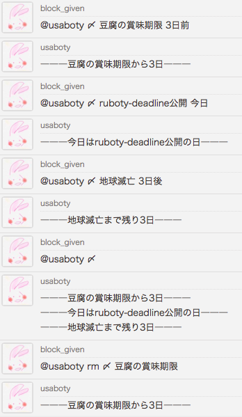

# Ruboty::Deadline

ruboty plugin for 〆



## Installation

Add this line to your application's Gemfile:

```ruby
gem 'ruboty-deadline'
```

And then execute:

    $ bundle

Or install it yourself as:

    $ gem install ruboty-deadline

## Usage

    @ruboty 〆 地球滅亡 3日後 # add 〆
    @ruboty 〆                # list 〆
    @ruboty rm 〆 地球滅亡    # remove 〆

## Contributing

1. Fork it ( https://github.com/blockgiven/ruboty-deadline/fork )
2. Create your feature branch (`git checkout -b my-new-feature`)
3. Commit your changes (`git commit -am 'Add some feature'`)
4. Push to the branch (`git push origin my-new-feature`)
5. Create a new Pull Request
